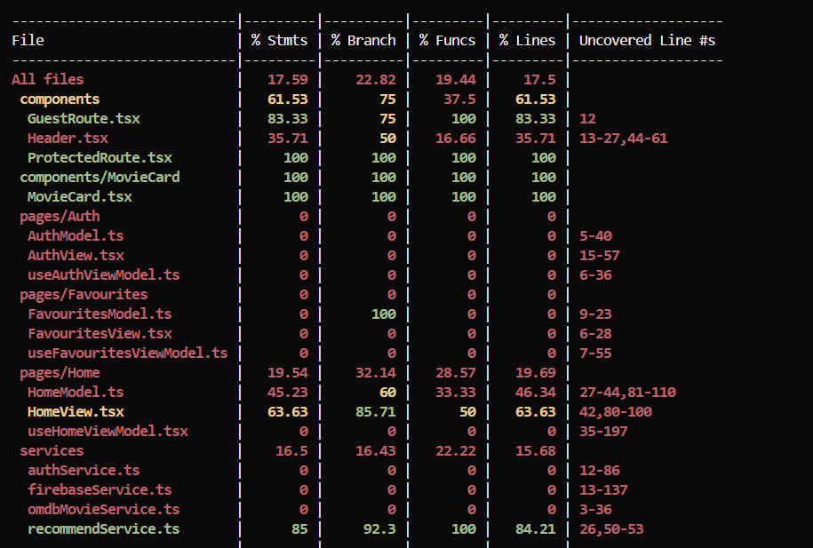

# Movie Finder: find movies by title or by mood

**Live app:** https://react-internship-project-navy.vercel.app
**Code:** https://github.com/InnaKuruohlu/react-internship-project

## Project brief

Movie Finder helps people who do not know the name of a movie, but know what they feel like watching. A normal search needs a title. So I added a box where users can write what a film they are looking for by writting something like "cozy and funny for tonight". The app sends this text to Google Gemini, and Gemini suggests a few movie titles. The app then looks up each title in OMDb and shows the movies as normal cards. It is made for people who want a suggestion, not a search box. Finally,I work on the AI part and to make the app ready for production.

## What the app does

- Search movies by title (OMDb)
- **AI mood search:** write what you want to watch (any language) and get movies
- Sign up and log in (Firebase Authentication)
- Save favourite movies for each user (Firebase Realtime Database)
- `/favourites` is only for logged-in users. `/auth` is only for guests.
- Loading, error and empty messages

## Run it on your computer

You need Node.js 20 or newer.

```bash
npm install && npm run dev
```

Open the address shown in the terminal.

Run the tests:

```bash
npm run test            # run once
npm run test:coverage   # with coverage report
```

**Important:** `npm run dev` only runs the React app. The AI part (`/api/recommend`) is a Vercel function, so AI search does not work with `npm run dev`. To try it locally, use `npx vercel dev` (you need a free Vercel login). You can also test it on a Vercel preview deployment. Everything else works locally.

### Environment variables

Make a `.env` file in the main folder. It is ignored by git. Do not commit real values.

| Name | Where it runs | What it is for |
|---|---|---|
| `VITE_OMDB_API_KEY` | browser | OMDb movie data (free key) |
| `VITE_FIREBASE_API_KEY`, `VITE_FIREBASE_AUTH_DOMAIN`, `VITE_FIREBASE_DATABASE_URL`, `VITE_FIREBASE_PROJECT_ID`, `VITE_FIREBASE_STORAGE_BUCKET`, `VITE_FIREBASE_MESSAGING_SENDER_ID`, `VITE_FIREBASE_APP_ID` | browser | Firebase settings (these are public by design; Firebase rules protect the data) |
| `GEMINI_API_KEY` | **server only** | Gemini key. Set in Vercel. The browser never sees it. |
| `GEMINI_MODEL` | server only | Which Gemini model to use (default `gemini-3.5-flash-lite`) |
| `GEMINI_FALLBACK_MODEL` | server only | Model to try once more if the first call fails with 503 or times out |

## How the code is organised

I use three parts: a **Model** (data and rules, no React), a **ViewModel** (React state and handlers) and a **View** (what you see).

```
api/
  recommend.ts              Vercel function: checks input, calls Gemini, returns { titles }
src/
  components/               Header, MovieCard, ProtectedRoute, GuestRoute
  pages/
    Home/                   HomeModel.ts, useHomeViewModel.tsx, HomeView.tsx
    Favourites/             FavouritesModel.ts, useFavouritesViewModel.ts, FavouritesView.tsx
    Auth/                   AuthModel.ts, useAuthViewModel.ts, AuthView.tsx
  services/
    omdbMovieService.ts     talks to OMDb
    recommendService.ts     talks to /api/recommend
    authService.ts          Firebase login
    firebaseService.ts      Firebase setup and favourites
  test/                     test setup
vercel.json                 makes direct links like /auth work (does not touch /api)
```

## How the AI part works

```
Text box (max 200 characters)
  -> POST /api/recommend  { mood }
  -> Vercel function checks the text and calls Gemini with the secret key
  -> Gemini returns JSON: { "titles": [ 1 to 8 movie titles ] }
  -> the function checks the JSON and sends it back
  -> the app searches OMDb for each title, removes duplicates
  -> movie cards under "Recommendations for: ..."
```

**The prompt.** I ask Gemini to return only JSON like `{"titles": string[]}` with 1 to 8 real movie titles that match the mood. No markdown, no extra text. The only thing sent as the user message is the mood text. The request also asks for JSON output with a schema, so the answer has the right shape.

**Why I built it this way**
- *A server function:* the API key must not go to the browser.
- *Check the answer:* AI output can be wrong. The function removes code fences, uses `try/catch`, and checks that every title is a non-empty string.
- *Gemini gives titles only:* OMDb gives the real movie data (poster, year, ID).
- *Privacy:* only the mood text goes to Gemini. Never the email or user ID. The page tells users not to write personal information, because on the free plan Google may use the text to improve its products.

**What happens when something fails**

| Problem | Server answer | What the user sees |
|---|---|---|
| Text missing, not text, or too long | 400 | A clear message |
| Gemini is busy (503) or too slow | one retry with the fallback model, then 502 | "The recommendation request timed out. Please try again." |
| Too many requests (429) | 429 | "The AI service is busy, please try again later." |
| Gemini returns bad JSON | 502 | "...invalid movie list." |
| No titles found in OMDb | none | "No movies found for that mood." |

In all these cases the normal movie list and the title search still work. Server logs only keep the status code or error name. They never keep the key or the user's text.

## Tests

I use Vitest and React Testing Library. There are 25 tests in 7 files. All pass.

| File | Tests | What it checks |
|---|---|---|
| `recommendService.test.ts` | 4 | success, error message from the server, network failure, wrong JSON shape |
| `HomeModel.test.ts` | 4 | short text rejected, duplicates removed, failed lookups skipped, empty result error |
| `MovieCard.test.tsx` | 3 | shows data, favourite click, missing poster |
| `HomeView.test.tsx` | 7 | label and max length, privacy note, submit, loading, error with `role="alert"`, results, empty state |
| `ProtectedRoute.test.tsx` | 3 | loading, redirect when logged out, shows page when logged in |
| `GuestRoute.test.tsx` | 2 | shows page when logged out, redirect when logged in |
| `Header.test.tsx` | 2 | links when logged out (the logged-in state is not tested) |

Coverage from `npm run test:coverage`: the `src/components` folder has 61.5%. `MovieCard` and `ProtectedRoute` have 100%. 5 of the 7 components and pages have tests. The whole project has only **17.6%**, because the Firebase code, the auth and favourites ViewModels and `useHomeViewModel` have no tests yet.

Full report from `npm run test:coverage` (7 test files passed, 25 tests passed):

```
----------------------------|---------|----------|---------|---------|
File                        | % Stmts | % Branch | % Funcs | % Lines |
----------------------------|---------|----------|---------|---------|
All files                   |   17.59 |    22.82 |   19.44 |    17.5 |
 components                 |   61.53 |       75 |    37.5 |   61.53 |
  GuestRoute.tsx            |   83.33 |       75 |     100 |   83.33 |
  Header.tsx                |   35.71 |       50 |   16.66 |   35.71 |
  ProtectedRoute.tsx        |     100 |      100 |     100 |     100 |
 components/MovieCard       |     100 |      100 |     100 |     100 |
 pages/Auth                 |       0 |        0 |       0 |       0 |
 pages/Favourites           |       0 |        0 |       0 |       0 |
 pages/Home                 |   19.54 |    32.14 |   28.57 |   19.69 |
  HomeModel.ts              |   45.23 |       60 |   33.33 |   46.34 |
  HomeView.tsx              |   63.63 |    85.71 |      50 |   63.63 |
  useHomeViewModel.tsx      |       0 |        0 |       0 |       0 |
 services                   |    16.5 |    16.43 |   22.22 |   15.68 |
  recommendService.ts       |      85 |     92.3 |     100 |   84.21 |
  authService.ts / firebaseService.ts / omdbMovieService.ts: 0 (not tested)
```



## Speed and accessibility

| Lighthouse (live site) | Before | After |
|---|---|---|
| Performance | 87 | 88 (this is normal noise, not a real improvement) |
| Accessibility | 100 | 100 |
| Best Practices | 96 | 96 |
| SEO | 91 | **100** |

Both runs were done in a normal browser window (not private), so the numbers can be a little different from a clean run. What is left on Performance: unused JavaScript (about 163 KiB, one big 845 kB file) and movie posters that come from OMDb.

**WAVE** (browser extension, full page): the home page has 0 errors, 0 contrast errors and 0 alerts. The `/auth` page also has 0, 0 and 0.

**What I fixed because of the audits**
1. *SEO 91 to 100:* I added a clear page title and a meta description in `index.html`.
2. *WAVE alert "No heading structure":* I added an `<h1>` to the home page.
3. *Found while testing:* opening `/auth` directly, or refreshing it, gave a 404 from Vercel. I fixed it with a rewrite rule in `vercel.json`. The rule does not touch `/api`.

### Screenshots

**Lighthouse before (SEO 91)**

[Lighthouse before](docs/screenshots/lighthouse-before.png)

**Lighthouse after (SEO 100)**

[Lighthouse after](docs/screenshots/lighthouse-after.png)

**WAVE: home page**

[WAVE home page](docs/screenshots/wave-home.png)

**WAVE: login page**

[WAVE login page](docs/screenshots/wave-auth.png)

**AI mood search working**

[AI search success](docs/screenshots/ai-success.png)

**When the AI fails, normal movies stay visible**

[AI failure with fallback](docs/screenshots/ai-failure-fallback.png)

## Deploying

The site is on Vercel. The `main` branch goes to Production. Other branches get a preview link. The filled checklist, the rollback plan and the monitoring notes are in [`docs/DEPLOYMENT_CHECKLIST.md`](docs/DEPLOYMENT_CHECKLIST.md).

## Known problems and what I would do next

- **The free Gemini plan is not always reliable.** While building, I saw 503 (busy), timeouts, and a 404 (a model name that my key could not use). To handle this I made the model names settings, added one retry with a second model, and show clear messages. The normal search always works. A paid plan or another provider would be more stable.
- **Sometimes the wrong movie shows.** The app uses the first OMDb result for each title. That can be a different movie with a similar name. Next step: search by exact title and year.
- **OMDb limits.** One AI search can make up to 8 OMDb requests, and the free key has a daily limit. The OMDb key is also visible in the browser. It is a free key, so the risk is low, but it is not private.
- **Not enough tests.** Firebase code, `useHomeViewModel`, `AuthView` and `FavouritesView` have no tests. The logged-in `Header` is not tested either.
- **Weak empty-result check.** `useHomeViewModel` finds "no movies" by comparing an error message text. A proper error type would be safer.
- **Big bundle.** One 845 kB JavaScript file. Splitting the code by page would help.
- **`npm audit` shows 4 high-severity warnings.** I have not looked into them yet.
- **Free plan and privacy.** Text sent to Gemini on the free plan may be used by Google. That is why the page has a warning.